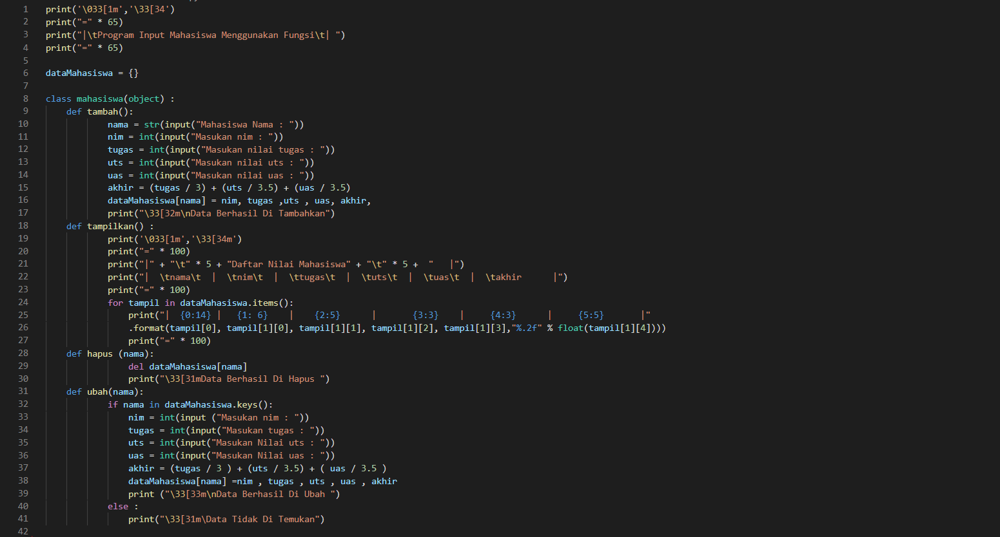
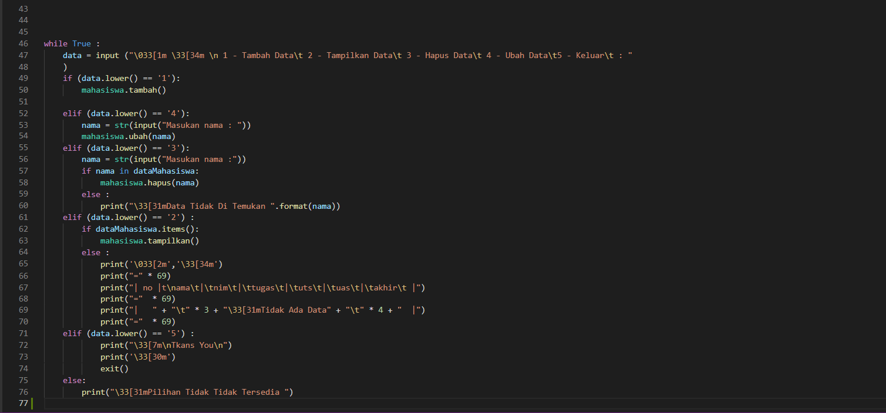
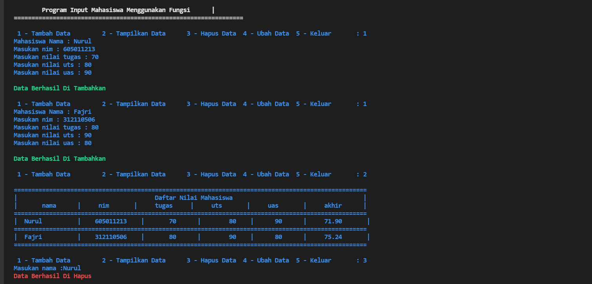

# Praktikum7

## Tugas pertemuan ke 11 Bahasa Pemrograman

## Nama  : Prayudha Ragil Musthofa

## NIM   : 312210726

## Kelas : TI.22.C.9

### Buat program sederhana dengan mengaplikasikan penggunaan class,
### Buatlah class untuk menampilkan daftar nilai mahasiswa, dengan kententuan :
### 1.Method tambah () untuk menambahkan data
### 2.Method tampilkan() untuk menampilkan data
### 3.Method hapus (nama) untuk menghapus data berdasarkan nama
### 4.Method ubah (nama) untuk mengubah data berdasarkan nama
### 5.Buatlah diagram class, flowchart dan penjelasan program nya pada README.md
### 6.Commit dan push repository ke github

## SS Input Program

## SS Output Dari Program

## Penjelasan singkat

### 1.Dekralarasi dataMahasasiwa sebagai object untuk menerima inputan data.

### 2.Deklarasi class di isi dengan method:

a) Def tambah() di isi dengan inputan nama, nim, tugas, uts, uas, akhir , di variable akhir di isi dengan penjumlahan dan bagi 3, untuk tugas 3.5 untuk uts, 3.5 untuk uas.
terakhir masukan semua kedalam object dataMahasiswa.

b) Def tampil() untuk mencetak object dataMahasiwa serta gunakan perulangan for untuk mecetak semua data jika di dalam object dataMahasiwa berisi banyak data.

c) Def hapus(nama) untuk menghapus data di dalam parameter nama dan gunakan syntax del.

d) Def ubah(nama) untuk mengubah data di dalam parameter nama dan gunakan statment if else nama di dalam dataMahasiswa lalu masukan kembali ke dalam object dataMahasiswa.

### 3.Gunakan pengulangan while True di isikan dengan inputan menu, lalu di dalamnya di isikan dengan statment if elif else.

### 4.Dalam statment if elif else di isikan dengan memanggil masing-masing method yang ada di dalam class mahasiswa.

# SEKIAN DAN TERIMAKASIH